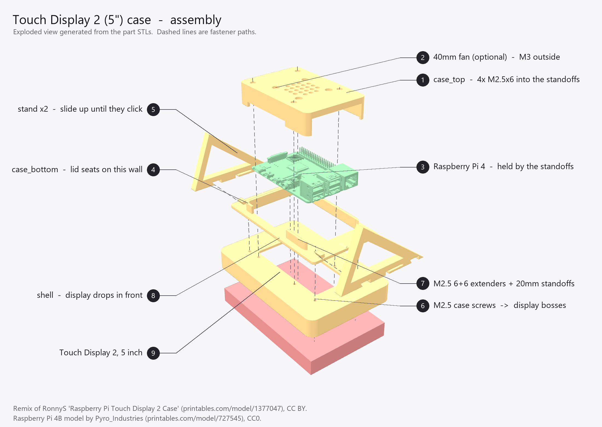

# Case — Raspberry Pi Touch Display 2 (5") + Raspberry Pi 4

A 3D-printable desk case for the **5-inch** Raspberry Pi Touch Display 2 with a
Raspberry Pi 4 mounted behind it, used landscape. Four printed parts, an
easel stand at a 20° lean, and an optional 40 mm fan.

## Credits and licence

This is a **remix of "Raspberry Pi Touch Display 2 Case" by RonnyS** —
<https://www.printables.com/model/1377047-raspberry-pi-touch-display-2-case> —
used under **CC BY**. The original targets the **7-inch** panel (its shell
pocket is 187 × 118 mm, matching the 7-inch outline of 189.32 × 120.24 mm); the
5-inch panel is 91.46 × 143.4 mm, so none of the original parts fit it. The
architecture is RonnyS's — shallow shell, bolt-on Pi clamshell, swappable
stand, optional fan — re-drawn parametrically in CadQuery at 5-inch scale.

This remix is released under **CC BY** as well. Credit RonnyS and this project.

The Raspberry Pi 4B model shown in the assembly diagram is by
**Pyro_Industries** — <https://www.printables.com/model/727545-raspberry-pi-4>,
CC0. It is used for illustration only and is not redistributed here.

Differences from the original, beyond scale:

- **No lid towers and no heat-set inserts.** The original bolts its lid to four
  M3-insert towers on the case-bottom, which forces a wider lid and a second
  screw chain. Here the lid screws into M2.5 male-female standoffs sitting on
  the Pi's own mounting holes, so one chain runs the whole stack and the lid
  continues the case-bottom's wall profile instead of straddling it.
- The fan is **hung off the lid** instead of a separate Pi-mounted bracket —
  a Pi-mounted plate plus fan does not fit the 5-inch stack's headroom.
  Note the fan clears the GPIO header by only 1.5 mm; check it on the real
  thing before relying on it.
- **The stand's foot is a plain blade, not a Y-fork.** The original splays each
  foot into two arms about 56 mm apart, which is what gives a narrow stand its
  sideways stability. Here the two stands are already 103.7 mm apart, so the
  fork earns nothing — and dropping it keeps the part a pure 2-D extrusion in
  print orientation, with no overhanging faces at all. Everything else about
  the fastening matches the original: a flat counterbored strap sharing that
  side's two display case screws.
- The shell keeps **discrete pass-through holes** for the standoffs rather than
  one large rear opening. On the 5-inch panel the case-screw bosses (y ±25.5)
  and the display's own Pi standoffs (y ±28.5) fall in the same band, so an
  opening big enough to clear the standoffs would swallow the screw bosses.
- No wall/V-slot brackets, no Pi 3/Pi 5 variants.

## Parts and printing

Print in **PETG**. An enclosed Pi 4 can creep toward PLA's glass transition
(~60 °C); PETG's is ~80 °C. It also takes heat-set inserts better and gives the
the stands stronger layer adhesion.

| File | Qty | Size (mm) | ~Mass | Orientation |
|---|---|---|---|---|
| `shell.stl` | 1 | 149.4 × 97.5 × 18.9 | 58 g | back plate **down** |
| `case_bottom.stl` | 1 | 126 × 76 × 10.5 | 21 g | plate **flat**, wall up |
| `case_top.stl` | 1 | 95 × 64 × 19.9 | 33 g | outer face **down** (as exported) |
| `stand_20_usb.stl` | 1 | 82 × 42.3 × 14.0 | 9 g | **flat** on the profile |
| `stand_20_dsi.stl` | 1 | 82 × 42.3 × 14.0 | 9 g | **flat** on the profile |

Pick one lean angle and print **both** files for it — one per side:

| Files | Lean | Stand size (mm) | Assembly depth on the desk |
|---|---|---|---|
| `stand_15_usb` + `stand_15_dsi` | 15° | 82.2 × 43.5 × 14.0 | 68.5 mm |
| `stand_20_usb` + `stand_20_dsi` | 20° | 82.0 × 42.3 × 14.0 | 73.9 mm |
| `stand_30_usb` + `stand_30_dsi` | 30° | 82.6 × 39.0 × 14.0 | 83.1 mm |

**The stands are handed** — `_usb` goes on the USB/Ethernet side, `_dsi` on the
ribbon side. They are mirror images, and an L-shaped profile has no mirror
symmetry in either axis, so no amount of turning one round will substitute for
the other. The screw holes sit 2.85 mm from the strap's inboard edge and
11.15 mm from its outboard one; fit the wrong one and the holes simply miss the
case screws by 8.3 mm, so the mistake is obvious rather than subtle.

Why not one symmetric part? The screw is at case X 51.85 and the case's −X wall
is at 48.5, so a symmetric strap could be at most 5.7 mm wide — narrower than
the Ø5.4 counterbore, which would leave the strap as a 1 mm web at both screws.

At every angle the foot stops **inside** the case's own silhouette (3.5 mm in at
15°, 21 mm at 30°), so the stand never sticks out behind the case; the depths
above are set by the leaning case, not by the foot.

Settings: 0.2 mm layer, 3 walls, 20 % infill, **no supports** — every part is
oriented so nothing overhangs beyond 45°.

The tolerances assume PETG. For PLA, drop `fit_clear` in `shell.py` from 0.5 to
0.4 mm.

## Hardware

| Item | Qty | Notes |
|---|---|---|
| M2.5 × 6+6 male-female standoff | 4 | extenders; relay the Pi mount plane past the case |
| M2.5 × 20 male-female standoff | 4 | clamp the Pi **and** take the lid screws |
| M2.5 × 6 screw | 4 | lid into the 20 mm standoffs |
| M2.5 × 16 screw | 4 | case screws: stand → case-bottom → shell → display |
| 40 × 40 × 10 mm 5 V fan | 1 | **optional** |
| M3 self-tapping screw | 4 | fan, from outside through the lid — optional |

**No heat-set inserts and no soldering iron** — everything threads into a
standoff. Screw lengths are calculated from the stack-up; confirm the
M2.5 × 16 against your panel, since the thread depth of the display's own
screw bosses is not published.

The stands add only **1.0 mm** to the case-screw stack — the strap is 3 mm
thick but 2 mm of that is counterbore, so the head drops most of the way in.
The same M2.5 × 16 therefore still works, with about 10 mm of thread in the
display's boss instead of 11 mm. If yours feel short, go to × 18.

The Pi is **not** carried by the case. The display's four built-in 15.9 mm
standoffs carry it, via the extenders. One screw chain runs the whole stack:

```
display standoff → 6+6 extender → Pi → 20 mm standoff → lid screw
```

The 20 mm standoff length sets the case height (lid inner face lands at
Z 27.4, clearing the USB connector cans by 4 mm). Substituting a different
length means changing `standoff` in `case_top.py` and re-running it.

## Assembly



The numbered callouts match the steps below. The diagram is generated from the
part STLs by `assembly_diagram.py`, so it cannot drift from the geometry —
re-run that script after changing any part.

1. Drop the display into the **shell** from the front. It is retained by the
   sandwich, not screwed to the shell.
2. Screw the four **M2.5 6+6 extenders** through the shell's back plate into the
   display's built-in standoffs (58 × 49 pattern).
3. Fit the **case-bottom** over the extenders, lay a **stand** on each side
   flange with its strut pointing down and back — `_usb` on the USB/Ethernet
   side, `_dsi` on the other — and run the four **case screws** (103.7 × 51
   pattern) through both into the display's screw bosses. Each stand's
   counterbore slots open toward the **middle** of the case; if they face
   outward you have the pair swapped. A driver reaches all four screws even with the
   Pi and lid fitted, provided the +X cables are unplugged, so you can change
   the lean angle later without taking the case apart.
4. Plug the **DSI ribbon** into the display, then seat the Pi on the extenders.
   The display's socket sits under the board, so bring the ribbon up through
   the bay, **wrap it around the board's DSI edge** and fold it onto the socket
   on the Pi's top face. Lay the slack **flat over the top of the Pi**. Do not
   bunch it underneath.
5. Screw the four **M2.5 × 20 standoffs** down through the Pi's mounting holes
   into the extenders. These clamp the Pi and provide the lid's threads.
6. Optional: screw the **fan** to the lid from the outside (32 × 32 pattern).
7. Fit the **lid** — its skirt seats on the case-bottom's wall — and secure with
   four **M2.5 × 6** screws through the top face into the standoffs.
## The stands

Each stand is an **L**: a flat strap that lies on the case-bottom's rear face
and carries both case screws, and a strut that leaves the strap's bottom end
and lies flat in the desk plane. There is deliberately **no diagonal brace**
between the two.

That absence is the whole design. A brace would have to cross the Pi's +X port
band, which is what sank the previous side-flange leg: its arm occupied
Z 2.5–11.5 while the USB and Ethernet **connector shells start at Z 6.65** —
0.75 mm *below* the PCB's top face, not level with it — so the bottom of every
plug fouled it. Here nothing crosses that band. The strap passes underneath it
(3 mm thick, clearing the plugs by 1.15 mm) and the strut stays outboard of it
in Y, by 4.9 mm at every angle.

Both members step in thickness, with the same 45° chamfer and the same 2:1
ratio. The strap is **3 mm across the port band and 6 mm past it**; the strut
is **9 mm at its root and 4.5 mm beyond 20 mm along the desk**. The strut's
bending moment is largest where it meets the strap and zero at the tip, so the
material out there was doing nothing — and thinning it also pulls the strut's
inner edge away from the plug band, which is what used to limit the 30°
variant to 2.9 mm of clearance. It can afford to be thin because the strut's root is itself a
desk contact — the toe touches down right where the strut meets the strap — so
the strut carries its load straight to the desk in compression and the strap
sees almost no bending. The thick section exists for the case where a print
tolerance lifts the toe slightly and the strap does have to take it.

Screw heads sit in **Ø5.4 × 2 mm counterbores**, which puts the head top at
Z 6.00 against the plugs at 6.65 even for a tall socket-cap head. The
counterbore is 0.7 mm wider than the head because it is a horizontal bore in
print orientation and its roof droops a little. Each counterbore is **opened
out through the strap's inboard edge**: the screw axis is only 2.85 mm from
that edge, so a plain circular pocket would leave a 0.15 mm fin standing 2 mm
tall, which would just break off. The head still lands on the full 1 mm floor,
and the Ø2.9 through-hole is what locates the screw.

Nothing here is compliant — no spring, no latch, no sustained strain — so
unlike the snap-on design it replaces, there is no creep to design around and
nothing whose grip depends on holding a 0.2 mm clearance.

**Releasing an Ethernet cable needs a small screwdriver.** The Pi 4's RJ45 jack
has its retention clip on the *underside*, and the strap passes 1.15 mm beneath
it, so there is no room for a fingertip — lift the clip with a thin blade
instead. Confirmed on hardware; easy enough, just not obvious. This is mostly
inherent to the case rather than the stand: with the strap removed entirely the
gap would only grow to 4.15 mm, because the case-bottom's own plate is at
Z 2.50. Both USB and Ethernet cables otherwise plug in and seat normally.

To change the lean angle, unplug the +X cables, undo the four case screws, swap
both stands and do them back up. The Pi and lid can stay where they are.

## Panel geometry

The **built-in Pi standoffs** — the four 15.9 mm towers on the panel's rear, in
the Pi's 58 × 49 pattern, which the extenders screw into — are **not centred**
on the panel. Measured on a real 5-inch unit:

- along the **long** axis: **34 mm** from the DSI/connector edge, 51.5 mm from
  the other (34 + 58 + 51.5 = 143.5)
- along the **short** axis: **21 mm** from each edge (21 + 49 + 21 = 91), i.e.
  centred

That gives `ext_off_x = -8.7`, `ext_off_y = 0` in `case_bottom.py` and
`shell.py`, placing the Pi board at x −41.2 … 43.8. Everything downstream — the
bay, the wall positions and the lid's port apertures — follows from it, so if
your panel measures differently, change those two values and re-run all three
scripts.

Do not confuse these with the **103.7 × 51 screw bosses**, which sit 5.5 mm
lower on the panel and take the case screws.

One consequence worth knowing: the display's DSI socket ends up *underneath*
the Pi board (2 mm from the Pi's own DSI socket), so the ribbon rises through
the bay, wraps around the board's DSI edge — there is 4.8 mm of bay past that
edge for the fold — and lands on the socket on the top face.

The DSI connector position (`ffc_x`) needs no check — the display's socket sits
essentially directly below the Pi's, and the bay clears it by 4.5–8.5 mm across
that range.

## Adjusting

Every part is a parametric CadQuery script; edit the `PARAMETERS` block and
re-run to regenerate the STL:

```bash
python shell.py
```

Useful knobs:

| Parameter | File | Effect |
|---|---|---|
| `tilts` | `stand.py` | which lean angles to export (default 15/20/30°) |
| `fit_clear` | `shell.py` | display pocket clearance (PETG 0.5, PLA 0.4) |
| `foot_len` | `stand.py` | stand depth — how far back the foot reaches |
| `foot_t`, `foot_t_thin`, `foot_step` | `stand.py` | strut thickness at the root, past the step, and where it steps |
| `strap_t_thin` | `stand.py` | strap under the port band — raising it eats the 1.15 mm plug gap |
| `grille_r`, `grille_pitch` | `case_top.py` | fan grille pattern |

`strap_x0` / `strap_x1` in `stand.py` must match `stand_strap_x0` and `half_x`
in `case_bottom.py` — they are the two ends of the flange the strap sits on.

The scripts carry assertions for the clearances that matter (ribbon, Pi
footprint versus the walls, screw ligaments, fan-screw versus grille), so a
parameter change that would cause a collision fails loudly instead of producing
a bad STL. `stand.py` additionally checks its whole profile against the Pi's
measured plug keepout at every tilt, allowing 2 mm for the one Pi-position
number never verified on a real panel.

The scripts carry assertions for the clearances that matter (ribbon, Pi
footprint versus the walls, screw ligaments, fan-screw versus grille), so a
parameter change that would cause a collision fails loudly instead of producing
a bad STL.
