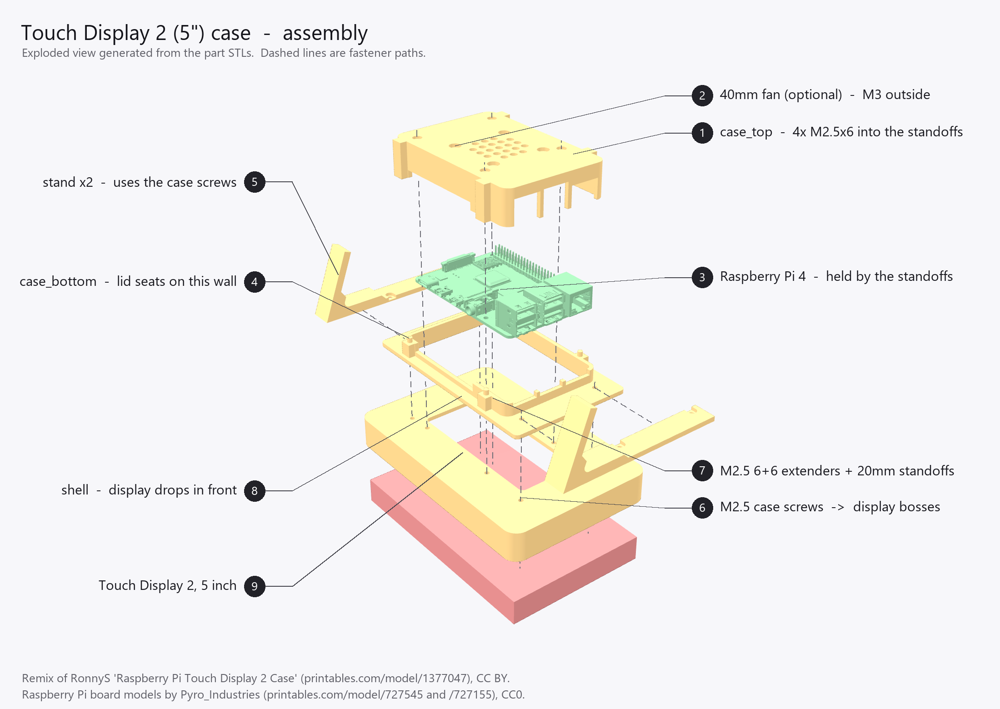

# Case — Raspberry Pi Touch Display 2 (5") + Raspberry Pi 4 or Pi 5

A 3D-printable desk case for the **5-inch** Raspberry Pi Touch Display 2 with a
Raspberry Pi 4 or Pi 5 mounted behind it, used landscape. Four printed parts, an
easel stand at a 20° lean, and an optional 40 mm fan.

The two boards share an outline and a mounting pattern, so only the port
openings differ. Print the files for the chosen board — see
[Choosing the board variant](#choosing-the-board-variant), and read it before
committing to a Pi 5: its display ribbon routing is genuinely different and
needs a part the panel does not come with.

## Credits and licence

This is a **remix of "Raspberry Pi Touch Display 2 Case" by RonnyS** —
<https://www.printables.com/model/1377047-raspberry-pi-touch-display-2-case> —
used under **CC BY**. The original targets the **7-inch** panel (its shell
pocket is 187 × 118 mm, matching the 7-inch outline of 189.32 × 120.24 mm); the
5-inch panel is 91.46 × 143.4 mm, so none of the original parts fit it. The
architecture is RonnyS's — shallow shell, bolt-on Pi clamshell, swappable
stand, optional fan — re-drawn parametrically in CadQuery at 5-inch scale.

This remix is released under **CC BY** as well. Credit RonnyS and this project.

The Raspberry Pi board models shown in the assembly diagrams are by
**Pyro_Industries** — <https://www.printables.com/model/727545-raspberry-pi-4>
and <https://www.printables.com/model/727155-raspberry-pi-5>, CC0. They are used
for illustration and for measuring connector positions, and are not
redistributed here.

Differences from the original, beyond scale:

- **No lid towers and no heat-set inserts.** The original bolts its lid to four
  M3-insert towers on the case-bottom, which forces a wider lid and a second
  screw chain. Here the lid screws into M2.5 male-female standoffs sitting on
  the Pi's own mounting holes, so one chain runs the whole stack and the lid
  continues the case-bottom's wall profile instead of straddling it.
- **The lid is located by four spigots, not by its screws.** The original's lid
  bolts into towers rising from its own plate — a short, stiff chain that needs
  no help. Ours bolts into standoffs stacked on the Pi, which is stacked on
  extenders, so the screws alone let the lid slide sideways on its seat. Four
  Ø3 pins on the wall top drop into blind sockets in the skirt and take that
  load instead. Measuring the original confirmed it has no register of its own:
  seated, the two parts meet in a plain butt joint with 0.00 mm of overlap.
- **Per-connector openings on the USB/Ethernet edge.** A continuous sill runs
  under the connectors and full-height dividers stand between them, so each
  connector gets its own window instead of one long slot. The sill is the
  original's idiom (its +X wall stops at Z 9.1 against a 12.4 wall top); the
  dividers are not — RonnyS leaves that edge as a single span.
- **The power/HDMI edge gets the sill but no dividers**, and that asymmetry is
  deliberate. On the USB/Ethernet edge the connectors protrude past the wall's
  outer face (to x 47.79 against 46.5), so a plug never touches the case and the
  sockets alone set the spacing. On the power/HDMI edge they stop at the wall's
  *inner* face, so the plug's overmould passes through the opening — and the two
  micro-HDMI sockets are only 13.5 mm apart, which is already tight for two
  cables on a bare Pi 4. Anything between them would likely stop both going in.
- The fan is **hung off the lid** instead of a separate Pi-mounted bracket —
  a Pi-mounted plate plus fan does not fit the 5-inch stack's headroom.
  Measured against the board models, the fan clears the GPIO header by only
  **1.10 mm**; check it on the real thing before relying on it. It does **not**
  clear a Pi 5 active cooler at all — see below.
- **The stand's foot is a plain blade, not a Y-fork.** The original splays each
  foot into two arms about 56 mm apart, which is what gives a narrow stand its
  sideways stability. Here the two stands are already 103.7 mm apart, so the
  fork earns nothing — and dropping it keeps the part a pure 2-D extrusion in
  print orientation, with no overhanging faces at all. Everything else about
  the fastening matches the original: a flat counterbored strap sharing that
  side's two display case screws.
- The shell keeps **discrete pass-through holes** for the standoffs rather than
  one large rear opening. On the 5-inch panel the case-screw bosses (y ±25.5)
  and the display's own Pi standoffs (y ±28.5) fall in the same band, so an
  opening big enough to clear the standoffs would swallow the screw bosses.
- No wall/V-slot brackets, and no Pi 3 variant.

## Parts and printing

Print in **PETG**. An enclosed Pi 4 can creep toward PLA's glass transition
(~60 °C); PETG's is ~80 °C. It also takes heat-set inserts better and gives the
the stands stronger layer adhesion.

The file list, quantities, print orientations and slicer settings are in
[`BOM.md`](BOM.md), along with the fasteners and cables. This section covers
the choices behind them.

`shell.stl` and the stands are the same for both boards — only `case_bottom`
and `case_top` are cut per model, and they must be a matching pair.

Pick one lean angle and print **both** files for it — one per side:

| Files | Lean | Stand size (mm) | Assembly depth on the desk |
|---|---|---|---|
| `stand_15_usb` + `stand_15_dsi` | 15° | 104.9 × 43.5 × 14.0 | 68.5 mm |
| `stand_20_usb` + `stand_20_dsi` | 20° | 105.4 × 42.3 × 14.0 | 73.9 mm |
| `stand_30_usb` + `stand_30_dsi` | 30° | 108.0 × 39.0 × 14.0 | 83.1 mm |

**30° is the marginal option.** Raising the case moves the centre of mass back,
so the rear tipping margin falls: 25.0 mm at 20° but only 11.5 mm at 30°, where
the strut tip also stops level with the case's own rear edge. It passes, but 15°
and 20° have far more room. Pick 30° for the viewing angle, not for stability.
It is also the angle that limits any further lift — it will fail there first.

The stands hold the case **25 mm** clear of the desk — 3 mm so it never rests on
its own corner, plus a deliberate 22 mm to get the power lead out (see below).
The depth on the desk is unchanged by that lift: it is set by the leaning case's
own silhouette, and the lift moves the case straight up, not backward. The strut
simply tucks a little further underneath.

**The stands are handed** — `_usb` goes on the USB/Ethernet side, `_dsi` on the
ribbon side. They are mirror images, and an L-shaped profile has no mirror
symmetry in either axis, so no amount of turning one round will substitute for
the other. The screw holes sit 2.85 mm from the strap's inboard edge and
11.15 mm from its outboard one; fit the wrong one and the holes simply miss the
case screws by 8.3 mm, so the mistake is obvious rather than subtle.

Why not one symmetric part? The screw is at case X 51.85 and the case's −X wall
is at 48.5, so a symmetric strap could be at most 5.7 mm wide — narrower than
the Ø5.4 counterbore, which would leave the strap as a 1 mm web at both screws.

At every angle the foot stops **inside** the case's own silhouette (3.5 mm in at
15°, 21 mm at 30°), so the stand never sticks out behind the case; the depths
above are set by the leaning case, not by the foot.

The tolerances assume PETG. For PLA, drop `fit_clear` in `shell.py` from 0.5 to
0.4 mm.

## Choosing the board variant

Both boards are 85 × 56 mm on the same 58 × 49 mounting pattern, so the shell,
the stands and the whole screw stack are shared. What differs is the ports.
Connector positions were measured off the reference board models rather than
taken from the board drawings, and live in `pi_models.py`; both scripts derive
their openings from that one table, so the wall gap and the lid aperture cannot
drift apart.

| | Pi 4 | Pi 5 |
|---|---|---|
| USB / Ethernet order on the +X edge | USB2, USB3, Ethernet | Ethernet, USB3, USB2 |
| 3.5 mm audio jack | yes | none |
| Display FPC connector | −X short edge | **−Y long edge** (x 6.7…15.2) |
| Display FPC type | 15-pin | 22-pin (0.5 mm) |
| Tallest point above the PCB | 16.8 mm | 16.4 mm |
| Clearance under the lid | 3.20 mm | 3.58 mm |
| Works with the optional 40 mm fan | yes | only **without** the active cooler |

Both boards carry the same stacked dual USB-A cans, so the tallest points above
should really be identical. The reference meshes disagree with themselves about
this — each models one USB block taller than the other beside it. The Pi 5's was
corrected to the measured-and-fitted value after a printed lid showed a visible
gap over the USB3 can and none over the USB2 one; the Pi 4's 0.4 mm is left as
measured, because that lid is validated on hardware and it has never shown.

Build the pair for that board:

```bash
python case_bottom.py pi5 && python case_top.py pi5
```

### Read this before choosing a Pi 5

**Built and fitted.** Both Pi 5 parts have been printed at the current revision
and confirmed to fit the board. An earlier build found one fault — the USB3
aperture was cut 1.32 mm taller than the USB2 one beside it, from an error in
the reference mesh rather than in these scripts — and the corrected lid has
since been printed and fitted in turn. Nothing about the Pi 5 pair is
outstanding. Feedback welcome.

The Pi 4 case is assembled and in daily service, and is the more travelled of
the two.

**The display ribbon does not route the same way.** On the Pi 4 the DSI socket
is on the short edge nearest the display's own FPC, so the ribbon rises through
the bay and folds straight onto it over about 20 mm. The Pi 5 has nothing on
that edge — both its MIPI connectors are on the −Y long edge, roughly 45 mm
further along — so the ribbon has to run across the top of the board to reach
one. There is room above the PCB for it, but the panel's own cable will not
reach and will not fit.

The part required is a single **Raspberry Pi Display Adapter Cable for Pi 5** —
22-way 0.5 mm pitch at the Pi end, 15-way 1 mm pitch at the display end — which
replaces the panel's cable outright. It is one part, not a cable plus an
adapter. Sold in 200 / 300 / 500 mm lengths; measure the routing before
choosing, as the run climbs through the bay and then crosses the board.

**Display and camera adapter cables are not interchangeable.** The Pi 5's two
MIPI connectors take either, and the cables look nearly identical, so Raspberry
Pi prints `DISPLAY` along the correct one. Check for that word before plugging
anything in.

**The active cooler and the lid fan are mutually exclusive.** The cooler stands
20.90 mm above the case floor where the fan hangs at 17.40 mm — a 3.5 mm clash.
The cooler costs no lid height otherwise (it sits below the USB cans, which
still set the tallest point), so fit the cooler and leave the fan out. The
grille holes still vent.

## Hardware

The fasteners, cables and the optional fan are listed in [`BOM.md`](BOM.md).
Screw lengths are calculated from the stack-up rather than measured, so confirm
the M2.5 × 16 against the panel in hand — the thread depth of the display's own
screw bosses is not published.

The stands add only **1.0 mm** to the case-screw stack — the strap is 3 mm
thick but 2 mm of that is counterbore, so the head drops most of the way in.
The same M2.5 × 16 therefore still works, with about 10 mm of thread in the
display's boss instead of 11 mm. If they feel short, go to × 18.

The Pi is **not** carried by the case. The display's four built-in 15.9 mm
standoffs carry it, via the extenders. One screw chain runs the whole stack:

```
display standoff → 6+6 extender → Pi → 20 mm standoff → lid screw
```

The 20 mm standoff length sets the case height (lid inner face lands at
Z 27.4, clearing the USB connector cans by 4 mm). Substituting a different
length means changing `standoff` in `case_top.py` and re-running it.

## Assembly



*Building the Pi 5 variant instead? The same diagram for that board is
[`assembly_pi5.png`](assembly_pi5.png) — the assembly steps below are identical,
only the port openings differ.*

The numbered callouts match the steps below. The diagram is generated from the
part STLs by `assembly_diagram.py`, so it cannot drift from the geometry —
re-run that script after changing any part.

1. Drop the display into the **shell** from the front. It is retained by the
   sandwich, not screwed to the shell.
2. Screw the four **M2.5 6+6 extenders** through the shell's back plate into the
   display's built-in standoffs (58 × 49 pattern).
3. Fit the **case-bottom** over the extenders, lay a **stand** on each side
   flange with its strut pointing down and back — `_usb` on the USB/Ethernet
   side, `_dsi` on the other — and run the four **case screws** (103.7 × 51
   pattern) through both into the display's screw bosses. Each stand's screw
   slots open toward the **middle** of the case; if they face outward the pair
   is swapped. A driver reaches all four screws even with the Pi and lid
   fitted, provided the +X cables are unplugged, so the lean angle can be
   changed later without taking the case apart — and because the slots are open,
   **slacken the screws by a few turns and slide the stand off sideways**
   rather than removing them.
4. Plug the **DSI ribbon** into the display, then seat the Pi on the extenders.
   The display's socket sits under the board, so bring the ribbon up through
   the bay, **wrap it around the board's DSI edge** and fold it onto the socket
   on the Pi's top face. Lay the slack **flat over the top of the Pi**. Do not
   bunch it underneath. *(Pi 5: the socket is on the long edge instead — run
   the ribbon across the top of the board to reach it.)*
5. Screw the four **M2.5 × 20 standoffs** down through the Pi's mounting holes
   into the extenders. These clamp the Pi and provide the lid's threads.
6. Optional: screw the **fan** to the lid from the outside (32 × 32 pattern).
7. Fit the **lid**. Line the four **sockets in the skirt** up with the four
   spigots on the wall top and press it down — the skirt seats on the wall and
   the spigots take up the side play. If it will not sit flush, a spigot has
   missed its socket; do not force it down with the screws. Then secure with
   four **M2.5 × 6** screws through the top face into the standoffs.

The spigots are a Ø3.0 pin in a Ø3.5 socket, so the lid can still shift about
0.25 mm before they bite — enough to assemble reliably in PETG, which prints
slightly proud. If they end up too tight to seat, or too loose to feel like
they are doing anything, change `spigot_fit` in `case_top.py` and re-print the
lid; the pin is not affected.

## The stands

Each stand is an **L**: a flat strap that lies on the case-bottom's rear face
and carries both case screws, and a strut that leaves the strap's bottom end
and lies flat in the desk plane. There is deliberately **no diagonal brace**
between the two.

That absence is the whole design. A brace would have to cross the Pi's +X port
band, which is what sank the previous side-flange leg: its arm occupied
Z 2.5–11.5 while the USB and Ethernet **connector shells start at Z 6.65** —
0.75 mm *below* the PCB's top face, not level with it — so the bottom of every
plug fouled it. Here nothing crosses that band. The strap passes underneath it
(3 mm thick, clearing the plugs by 1.15 mm) and the strut stays outboard of it
in Y, by 4.9 mm at every angle.

Both members step in thickness, with the same 45° chamfer and the same 2:1
ratio. The strap is **3 mm across the port band and 6 mm past it**; the strut
is **9 mm at its root and 4.5 mm beyond 20 mm along the desk**. The strut's
bending moment is largest where it meets the strap and zero at the tip, so the
material out there was doing nothing — and thinning it also pulls the strut's
inner edge away from the plug band, which is what used to limit the 30°
variant to 2.9 mm of clearance. It can afford to be thin because the strut's root is itself a
desk contact — the toe touches down right where the strut meets the strap — so
the strut carries its load straight to the desk in compression and the strap
sees almost no bending. The thick section exists for the case where a print
tolerance lifts the toe slightly and the strap does have to take it.

Screw heads sit in **Ø5.4 × 2 mm counterbores**, which puts the head top at
Z 6.00 against the plugs at 6.65 even for a tall socket-cap head. The
counterbore is 0.7 mm wider than the head because it is a horizontal bore in
print orientation and its roof droops a little.

**Both screw features are open slots, not holes**, running out through the
strap's **inboard** edge — the side facing the middle of the case. The
counterbore has to be: the screw axis is only 2.85 mm from that edge, so a
plain circular pocket would leave a 0.15 mm fin standing 2 mm tall, which would
just break off. The Ø2.9 through-hole is slotted for a different reason — so a
stand can be **slid on and off with the case screws merely slackened**, rather
than withdrawn. Taking them right out means holding the display, shell and
case-bottom together unaided, which is the awkward part of changing the lean
angle.

The mouths face inboard because that is the only direction that works: the
stand is offered up about 3 mm outboard of its seated position, overhanging the
free edge of the plate, and slid inward onto the screws. Mouths on the outboard
edge would need it to start 2.85 mm further *in*, driving its inboard edge
straight into the case's −X wall. The consequence is that nothing locates the
stand along X any more except friction under the screw heads — which is fine in
service, because the case's weight acts across the slots rather than along
them, but do tighten both screws before letting go.

Nothing here is compliant — no spring, no latch, no sustained strain — so
unlike the snap-on design it replaces, there is no creep to design around and
nothing whose grip depends on holding a 0.2 mm clearance.

**Releasing an Ethernet cable needs a small screwdriver.** The Pi 4's RJ45 jack
has its retention clip on the *underside*, and the strap passes 1.15 mm beneath
it, so there is no room for a fingertip — lift the clip with a thin blade
instead. Confirmed on hardware; easy enough, just not obvious. This is mostly
inherent to the case rather than the stand: with the strap removed entirely the
gap would only grow to 4.15 mm, because the case-bottom's own plate is at
Z 2.50. Both USB and Ethernet cables otherwise plug in and seat normally.

### Power lead clearance — why the stands lift the case

The power socket faces down toward the desk. On the original 7-inch case the
body is tall enough to swallow a straight plug; at 5 inches it is not, and this
is the one place the smaller scale really bites. Before the lift there was only:

| Lean | Room from the socket face to the desk | With the 22 mm lift |
|---|---|---|
| 15° | 17.4 mm | **40.2 mm** |
| 20° | 16.6 mm | **40.0 mm** |
| 30° | 15.7 mm | **41.1 mm** |

A straight plug's overmould, plus the bend the lead needs before it can run
flat, is far longer than the original figures — in practice **even a right-angle
adaptor's overmould did not fit**. So the stands raise the whole case by a
deliberate 22 mm (`lift` in `stand.py`), on top of the 3 mm that keeps it off
its own corner.

Every one of those figures was set on hardware, not modelled. 10 mm cleared a
right-angle adaptor. 20 mm got the **official Raspberry Pi power supply** in but
only just — its captive cable is thick and has very little flex, so it cannot
turn tightly and was still working against the desk. **22 mm is the printed and
fitted answer.** It is sized for the supplied PSU deliberately — most people
printing this case will have one, and "the power supply in the box does not fit"
is a bad thing to discover after a print.

Two things worth understanding about that fix:

- **Leaning further back makes the problem worse, not better** — it brings the
  socket closer to the desk. The lift is perpendicular to the desk, so it buys
  `lift / cos(tilt)` along the plug axis. That is why all three angles land at
  about the same 40 mm: the lift cancels the penalty for leaning back.
- **It improves the front tipping margin** rather than hurting it, from 12.0 mm
  unlifted to 20.0 mm at 20°. The strap lies on the *tilted* rear face, so
  extending it moves the toe down **and forward**, widening the front contact
  faster than the rising centre of mass eats it. The rear margin gives up the
  same amount and still has 25 mm at 20°. Don't assume raising a leaning case
  costs stability — but see the 30° warning above, because that is where the
  rear margin runs out first.

The toe still sits 11.3 mm behind the glass edge at 20°, so nothing protrudes in
front of the display.

To change the lean angle, unplug the +X cables, undo the four case screws, swap
both stands and do them back up. The Pi and lid can stay where they are.

## Panel geometry

The **built-in Pi standoffs** — the four 15.9 mm towers on the panel's rear, in
the Pi's 58 × 49 pattern, which the extenders screw into — are **not centred**
on the panel. Measured on a real 5-inch unit:

- along the **long** axis: **34 mm** from the DSI/connector edge, 51.5 mm from
  the other (34 + 58 + 51.5 = 143.5)
- along the **short** axis: **21 mm** from each edge (21 + 49 + 21 = 91), i.e.
  centred

That gives `ext_off_x = -8.7`, `ext_off_y = 0` in `case_bottom.py` and
`shell.py`, placing the Pi board at x −41.2 … 43.8. Everything downstream — the
bay, the wall positions and the lid's port apertures — follows from it, so if a
panel measures differently, change those two values and re-run all three
scripts.

Do not confuse these with the **103.7 × 51 screw bosses**, which sit 5.5 mm
lower on the panel and take the case screws.

One consequence worth knowing: the display's DSI socket ends up *underneath*
the Pi board (2 mm from the Pi's own DSI socket), so the ribbon rises through
the bay, wraps around the board's DSI edge — there is 4.8 mm of bay past that
edge for the fold — and lands on the socket on the top face.

The DSI connector position (`ffc_x`) needs no check — the display's socket sits
essentially directly below the Pi's, and the bay clears it by 4.5–8.5 mm across
that range.

## Adjusting

Every part is a parametric CadQuery script; edit the `PARAMETERS` block and
re-run to regenerate the STL:

```bash
python shell.py
```

Useful knobs:

| Parameter | File | Effect |
|---|---|---|
| `tilts` | `stand.py` | which lean angles to export (default 15/20/30°) |
| `fit_clear` | `shell.py` | display pocket clearance (PETG 0.5, PLA 0.4) |
| `foot_len` | `stand.py` | stand depth — how far back the foot reaches |
| `foot_t`, `foot_t_thin`, `foot_step` | `stand.py` | strut thickness at the root, past the step, and where it steps |
| `strap_t_thin` | `stand.py` | strap under the port band — raising it eats the 1.15 mm plug gap |
| `grille_r`, `grille_pitch` | `case_top.py` | fan grille pattern |
| `spigot_fit` | `case_top.py` | lid socket clearance — how much play before the spigots bite |
| `port_clear`, `min_divider` | both | clearance around each connector, and the thinnest divider allowed |
| `bot_sill_clear` | `case_bottom.py` | how far the power/HDMI sill sits below the sockets |

**`bot_sill_clear` is the least certain number in the case.** Nothing here
measures how far a plug's overmould hangs below its socket, so it is set to a
deliberately generous **2.0 mm**, putting the sill top at Z 5.35 on a Pi 4 and
6.00 on a Pi 5.

One flat sill spans the whole opening, so this is the margin under the **lowest**
socket — the **USB-C** on both boards, which is the one to check first if
anything fouls. Every other port on that edge gets at least as much: on a Pi 4
the micro-HDMIs and the audio jack clear the sill by 2.65 mm. If a particular
cable still will not seat, raise this value and re-print the case-bottom.

The USB/Ethernet sill needs no such margin (0.35 mm), since no plug ever reaches
it.

Port geometry is not edited directly: it comes from the measured tables in
`pi_models.py`. Correct a connector there and both parts follow.

`strap_x0` / `strap_x1` in `stand.py` must match `stand_strap_x0` and `half_x`
in `case_bottom.py` — they are the two ends of the flange the strap sits on.

The scripts carry assertions for the clearances that matter (ribbon, Pi
footprint versus the walls, screw ligaments, fan-screw versus grille), so a
parameter change that would cause a collision fails loudly instead of producing
a bad STL. `stand.py` additionally checks its whole profile against the Pi's
measured plug keepout at every tilt, allowing 2 mm for the one Pi-position
number never verified on a real panel.
