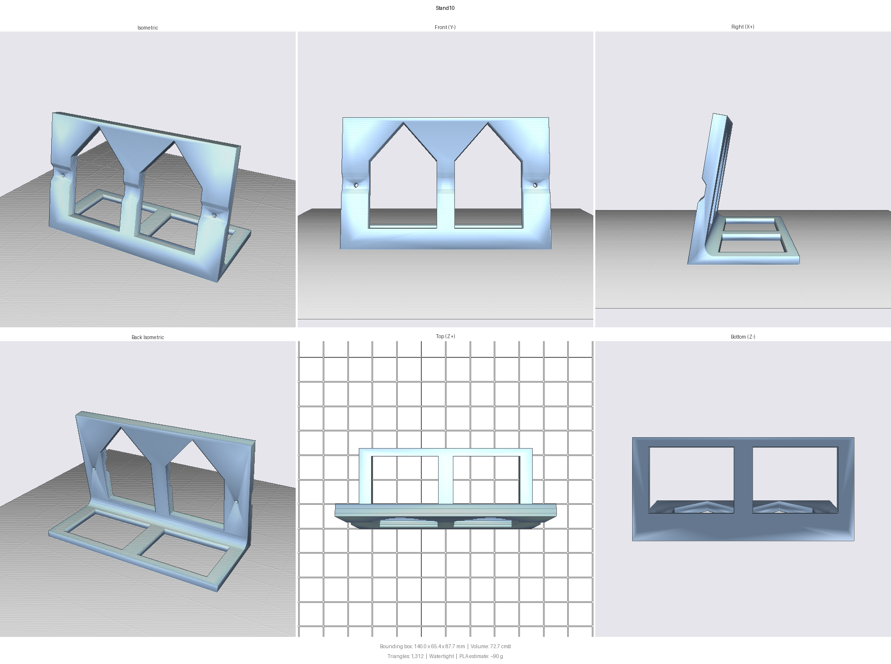

# 🖥️ Stand — Raspberry Pi Touch Display 2 (10.1")

A 3D-printable desk stand for the **10.1-inch** Raspberry Pi Touch Display 2
with a Raspberry Pi 5 mounted on its back. One printed part, two screws, a 10°
backward lean.

The 10.1" panel needs no enclosure — the Pi bolts to the standard 58 × 49 mm
pattern in the middle of the back plate, and its active cooler wants free air.
Only a way to stand the panel on a desk is missing.

**Highlights**

- One part, two M2.5 screws, no other fasteners.
- About 44 g of PETG, roughly 2¼ hours, no supports and no brim.
- The panel hangs clear of the desk, so nothing shows below the bezel.
- Bolts to the lower bracket pair only, clear of the DSI ribbon.



## ⚠️ Panel orientation

> [!WARNING]
> **The panel mounts 180° from the way it arrives.** The part does not fit the
> other way up.

The two bracket pairs sit at different offsets from their nearest short edge,
and the Pi is not centred vertically. Mounted as delivered, only 14 mm of back
plate is clear above the lower brackets before the board begins. Turned over,
59 mm is clear.

The image and touch mapping are turned to match by `build10/display.py`
(`ROTATE_DEG = 180`). **No change to `/boot/firmware/config.txt` is required.**

> [!NOTE]
> The DSI overlay's `rotation=180` has no effect on this display, which writes
> straight to `/dev/fb0`. Its `invx,invy` do work, but must not be set as well
> — they cancel against the software mapping and invert every tap.

## 🔧 Requirements

| | |
|---|---|
| Panel | Raspberry Pi Touch Display 2, 10.1", Pi already mounted |
| Screws | **2 × M2.5 × 12 mm**, pan or socket head |
| Filament | PETG, about 44 g |
| Print bed | 140 × 65 mm minimum, 88 mm height |

M2.5 × 12 is confirmed on hardware. The bosses are threaded 8 mm deep and the
pad is 5 mm thick, giving 7 mm of engagement without bottoming out.

## 🖨️ Printing

```
PETG, 0.2 mm layer, 3 walls, 20% infill, no supports.
Orientation: foot flat on the bed, upright rising — as modelled, no rotation.
```

PETG rather than PLA because the panel is an always-on device in a warm room:
PETG's glass transition is ~80 °C against PLA's ~60 °C.

No supports and no brim are needed. The upright leans 10°, the window gables
are pitched past 45°, and the foot puts about 4,600 mm² on the bed. The only
downward-facing surfaces are the two screw bores, which span 2.9 mm and bridge.

## 🔩 Assembly

1. Rest the panel face-down on something soft, turned 180° from its delivered
   orientation — the Pi's port face at the **top**.
2. Offer the stand up to the lower bracket pair. The flat pads around the screw
   holes sit on the bosses; the faces above and below them come to rest against
   the back plate itself.
3. Run an M2.5 × 12 through each hole into the boss. Firm, not tight — there is
   no washer face, and PETG dishes if over-torqued.
4. Stand the assembly up.

The panel ends up hanging about 2 mm clear of the desk. Its weight is carried
by the two screws in shear.

## 📐 Key dimensions

All in the mounted orientation, i.e. after the 180° turn.

| | |
|---|---|
| Stand | 140 × 65 × 88 mm |
| Panel outline | 167 × 247 mm |
| Lower bosses | 121.8 mm apart, 41 mm up from the bottom edge |
| Bosses | M2.5, 3 mm proud of the back plate, 8 mm thread depth |
| Pi, port face to SD end | 100 – 187 mm up the back plate |
| Mass, panel + Pi | 558 g |

## 🛠️ Troubleshooting

**The assembly rocks on the desk.** The front face is meant to touch the back
plate both above and below the screws. If only one side is touching, check that
the pads are seated squarely on the bosses and that neither screw is
over-tightened.

**The stand fits, but at the wrong end of the display.** The panel is the wrong
way up — see [Panel orientation](#️-panel-orientation).

**The top of the stand fouls the DSI ribbon.** The ribbon loops under the board
and hangs below it. The upright stops at 87 mm to clear it; a taller value in
`stand10.py` will press on the loop.

**Taps land diagonally opposite the finger.** Both the software mapping and the
overlay's `invx,invy` are inverting the touchscreen. Remove the overlay
parameters.

## ⚙️ Parameters

Every dimension is a parameter at the top of `stand10.py`. Rebuild and verify
with:

```bash
python stand10.py && python check_stand10.py
```

| Parameter | Default | Effect |
|---|---|---|
| `tilt` | 10.0 | Backward lean, degrees |
| `foot_depth` | 65.0 | Rearward reach; sized for the hanging cable, not the panel |
| `clear_z` | 2.0 | Gap between the panel's bottom edge and the desk |
| `stand_w` | 140.0 | Width across; stays hidden behind the 167 mm panel |
| `bear_s1` | 87.0 | Top of the upright; limited by the DSI ribbon |
| `hole_d` | 2.9 | M2.5 clearance |

## 📄 Licence and credits

**GPL-3.0**, as the rest of this repository. This differs from
[`case/`](../case), which is CC BY as a remix of RonnyS's Touch Display 2 case.
Nothing here derives from that work, so the attribution requirement does not
apply. Credit is welcome, not required.

Issues and suggestions are welcome via the repository's issue tracker.
